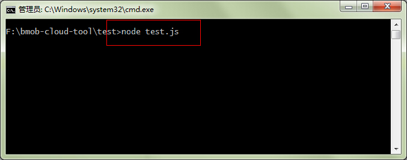
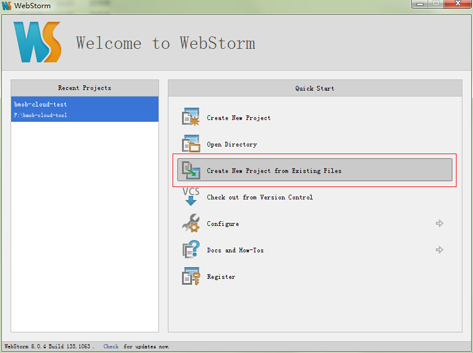
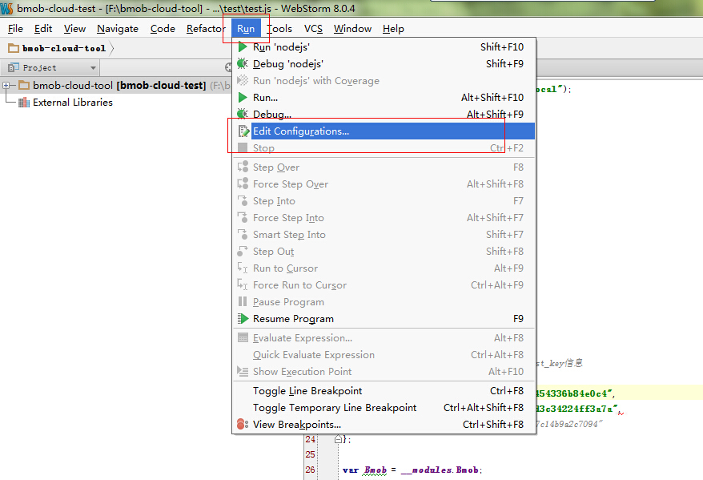
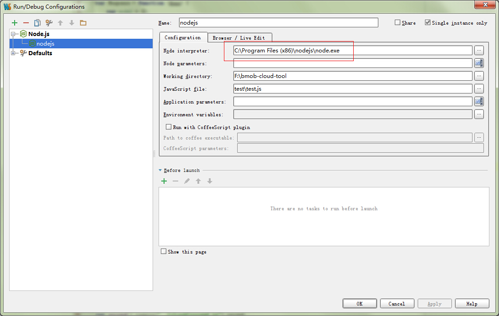
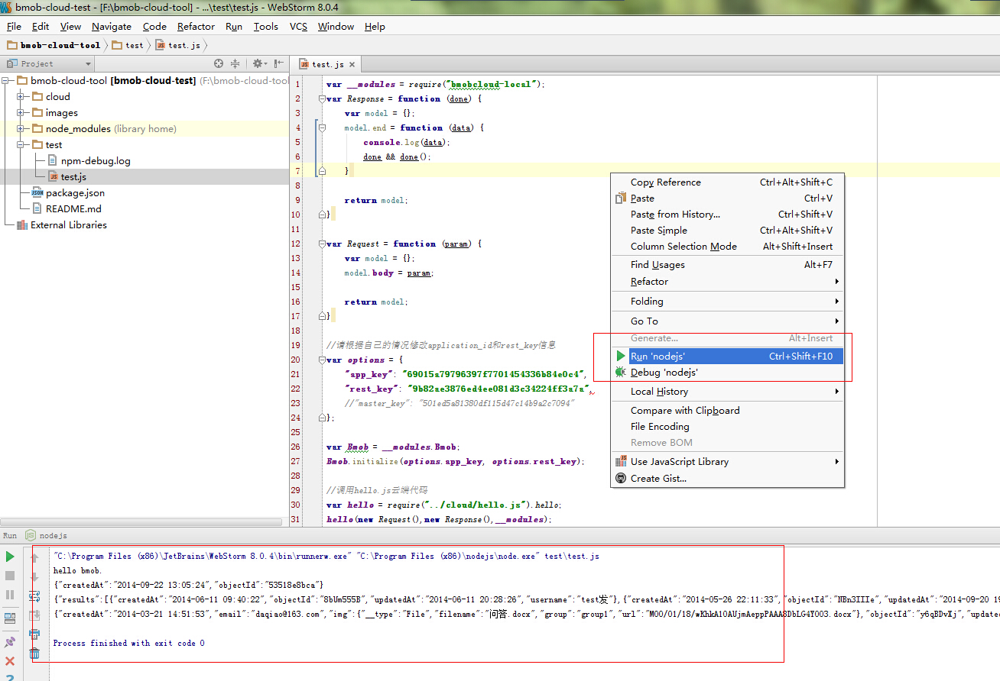

Bmob云端代码本地调试工具
=========================

提供这个开发工具是为了方便大家对云端代码进行调试，可以结合一些IDE和Node编译器，直接先在本地电脑上将云端代码编辑好再添加到云端，以便更好的开发。

## 准备工作

1. 根据自己的操作系统的情况，下载并安装NodeJs编译器（http://www.nodejs.org/download/）。

2. Clone这个Repo的到本地电脑。

## 编写云端代码

1. 进入Repo的cloud文件夹，编写相应的云端代码（可参考我们提供的demo）。

2. 根据自己的APP信息，修改`AppConfig.json`的`app_key`和`rest_key`信息。

## 命令行调试

1. 打开命令提示符工具，进入到Repo对应的test目录下。

2. 执行命令`node test.js`，即可看到调试信息。如下图所示：

## WebStorm IDE调试（推荐）

你还可以借助一些IDE工具进行云端代码的编辑和调试，下面以WebStorm（下载地址：http://www.jetbrains.com/webstorm/ ）为例进行阐述。

1. 导入Repo工程。

2. 修改NodeJs编译器的路径信息。过程如下：执行菜单Run->Edit Configurations，并修改NodeJs的安装路径，如下图所示

3. 打开test/test.js文件，右击鼠标，在弹出菜单中选择“Run 'nodejs'”，如果配置无误的话就可以看到调试结果了，如下图所示：

## 本地和云端代码的同步

本工具提供了两种方式进行云端代码的调试：本地调试和服务端调试，分别对应于test.js脚本里的`local()`和`server()`方法。它们的区别主要在于云端代码的运行端，服务端调试会将本地代码同步到Bmob云端中去执行，而本地调试只是在本地执行。一般而言，大家可以先用本地调试的方法先把代码调好，然后再调用服务端调试的方法，一键同步本地代码到Bmob云端执行。

## Bmob官方信息

官方网址：[http://www.bmob.cn](http://www.bmob.cn)

问答社区：[http://wenda.bmob.cn](http://wenda.bmob.cn)

技术邮箱：support@bmob.cn
